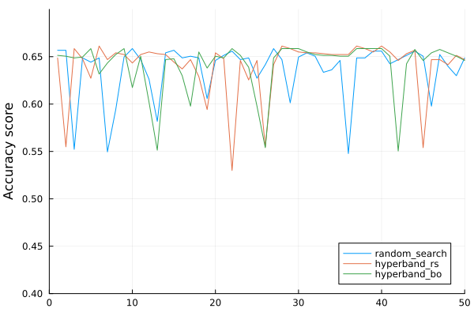
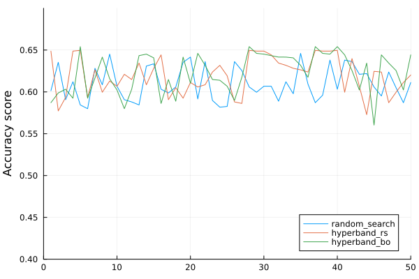

# Hyperparameter optimization report

## Introduction

This report is a summary of the hyperparameter optimization process for the models used to predict the red wine quality with `winequality-red.csv` dataset. Since there are only six different quality levels (i.e. 3-8), I treat this problem as a classification problem. The goal is to find the best hyperparameters for each model to maximize the accuracy of the predictions. Three ML models are used in this report: Random Forest, Gradient Boosting, and Support Vector Machine.

## Dataset description

The dataset contains 1599 observations with 12 columns in each observation. There is no missing data in the dataset. The target variable is `quality`, which is an integer between 3 and 8. The rest of the columns are features of the wine. I consider all feature columns as continuous numerical variables. The dataset is divided into 70% training and 30% testing.

## Experiment setup

I used Julia to run the experiments. In particular, the two main packages `AutoMLPipeline` and `Hyperopt` are used to perform the hyperparameter optimization. The `AutoMLPipeline` package provides a high-level interface to design the training pipeline and the `Hyperopt` package provides the hyperparameter optimization algorithm. The `AutoMLPipeline` package also provides a convenient way to perform cross-validation and evaluate the model performance. A random seed is used to ensure experiment reproducibility. Given the type of the problem, I use accuracy as the metric to evaluate the model performance. For this classification problem, I choose these three models to perform the hyperparameter optimization: Random Forest, Gradient Boosting, and Support Vector Machine. This choice is based on the application of the models and my personal preference for exploration with them.

I will discuss the experiment setup in two sections: preprocessing and hyperparameter optimization.

### Preprocessing

First, the features are discretized into categorical and numerical variables based on the data type and the occurrence of each unqiue values. The numerical variables are normalized using the `RobustScaler` and then dimension reduced with 5 components PCA. The categorical variables are then encoded using one-hot encoding. However, as aforementioned in the dataset description, all features are considered as continuous numerical variables. Therefore, all features are treated with numerical preprocessing.

### Hyperparameter optimization

The hyperparameter optimization is performed using the `Hyperopt` package. The `Hyperopt` package provides a convenient and clean API to achieve HPO with various sampler. For each model, I used three samplers for HPO: random sampler (RS), Hyperband with random sampler (RSHB) and Hyperband with Bayesian sampler (BOHB). Since `Hyperopt`'s Bayesian sampler can only be used for continuous variables, SVM is not included in the Bayesian sampler run. Since we want to maximize the accuracy, the objective function is set to minimize the negative accuracy. The maximum number of iterations is set to 50 for random sampler, and the resource for HB is R=50 with n=3. The best hyperparameters are selected based on the best accuracy. The model is evaluated using 5-fold cross-validation. The accuracy is used as the metric to evaluate the model performance.

Nested resampling is used in the HPO process. The outer sampling process is `hpo.jl:31`, where data is splited into training and testing sets. The inner sampling sampling is `hpo.jl:78`, where each Hyperparameter set evaluation is performed with 5-fold CV with the training data. Testing and outer sampling performance evaluation is done on `hpo.jl:124`. The outer sampling was not repeated because of two reasons:
1. The current sampling for these three learners with three (2 for SVM) HPO methods takes a very long time (~1 hour to run)
2. Since the parameter spaces to sample from are large, the algorithm should be able to have explored parameter set with good generalizability.
To ensure reproducibility, I set seed for each sampling and CV. Due to current interface limitation, this behavior can be non-ideal with inner sampling.

## Results

### Random Forest

The hyperparameters to optimize are number of estimators with range [10, 300), max tree depth [1, 30) and max number of features [1, 30). The performance/loss plot for the random sampler, RSHB, and BOHB is shown below.

There are two clear observations in the plot:

1. There is a accuracy roof around 0.6 for all HPO algorithm.
2. The BOHB sampler reaches the accuracy roof ("converge") faster than the random sampler and RSHB.

The best hyperparameters for each sampler are shown in the table below.

| Sampler | n_estimators | max_depth | max_features | 5-fold test CV mean accuracy |
|---------|-------------|------------------|-------------|----------|
| RS | 102 | 10 | 4 | 0.5667 |
| RSHB | 110 | 23 | 12 | 0.5916 |
| BOHB | 101 | 19 | 18 | 0.5708 |

### Gradient Boosting

The hyperparameters to optimize are number of estimators with range [10, 500), learning rate [0.01, 0.5) and max depth [1, 30). The performance plot for the random sampler, RSHB, and BOHB is shown below.

THe plot above is noiser than the random forest performance plot. Generally, the BOHB sampler performs consistently better than the random sampler and RSHB, as the green line is above two other lines most of the time.

The best hyperparameters for each sampler are shown in the table below.

| Sampler | n_estimators | learning_rate | max_depth | 5-fold test CV mean accuracy |
|---------|-------------|------------------|-------------|----------|
| RS | 228 | 0.07434| 9 | 0.5396 |
| RSHB | 434.0 | 0.3763 | 6.0 | 0.5521 |
| BOHB | 441.0 | 0.2872 | 7.0 | 0.5813 |

### Support Vector Machine

Since the kernel types of SVM are discrete and `Hyperopt`'s Bayesian sampler does not support categorical variable, the Bayesian sampler is not used for SVM. The hyperparameters to optimize are C (regularization) with range [0.1, 10), kernels have these options [linear, poly, rbf, sigmoid], and gamma with range [1, 10). The performance plot for the random sampler and RSHB is shown below.

The performance plot does not show a clear trend as the previous two models. The random search and RSHB have very similar performance in terms of discovering the performance roof. The best hyperparameters for each sampler are shown in the table below.

| Sampler | C | kernel | gamma | 5-fold test CV mean accuracy |
|---------|-------------|------------------|-------------|----------|
| RS | 5.7 | rbf | 10 | 0.5667 |
| RSHB | 5.5 | rbf | 6 | 0.5542 |

## Conclusion

The boxplot to compare the performance of the three models using Hyperband with random sampler is shown below.

The figure above shows that the random forest has the best overall performance among the three models. It has highest average accuracy and lowest dispersion. The gradient boosting has the second best performance, and the SVM has the worst performance. The SVM model has the highest dispersion and lowest average accuracy as expected, because the performance curve of SVM is noisier than the other two models.
